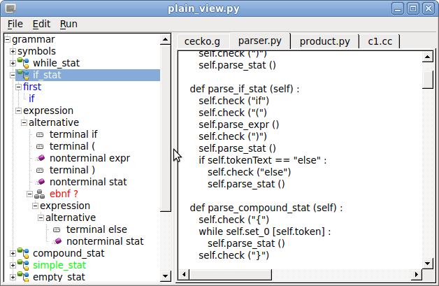

# plain-grammar
Parser generator written in Python

## Simple C grammar

```c

while_stat :  "while" "(" expr ")" stat   ;

if_stat    :  "if" "(" expr ")" stat ( "else" stat  )?   ;

compound_stat : "{" ( stat )* "}" ;

simple_stat :  expr ";" ;

empty_stat :  ";" ;

stat : while_stat | if_stat | compound_stat | simple_stat | empty_stat ;


simple_expr : identifier | number  | "(" expr ")" ;

mult_expr :  simple_expr ( ("*"|"/") simple_expr )* ;

add_expr :  mult_expr ( ("+"|"-") mult_expr )* ;

expr : add_expr ( "," expr )? ;


program : stat;
```

#### Grammar rule

```
   rule_name : rule_expression ;
```

#### Terminals

Teminals are written in double quotes

```
    "while" "(" ")"
```

#### Nonterminals

Nonterminals (names of another rules) are simple identifiers without quotes

```
   expr
```

#### Alternatives |

Alternatives are denoted by vertical bar

```
   stat : while_stat | if_stat | compound_stat ;
```

```
   ( "*" | "/" )
```

#### Optional section (  )?

```
   ( "else" stat  ) ?
```

#### Repeat zero, one or more times (  )*

```
   ( stat )*
```

#### Repeat one, two or more times (  )+

```
   ( stat )+
```

## Generated Parser

```python
from lexer import Lexer

class Parser (Lexer) :

   def parse_if_stat (self) :
      self.check ("if")
      self.check ("(")
      self.parse_expr ()
      self.check (")")
      self.parse_stat ()
      if self.tokenText == "else" :
         self.check ("else")
         self.parse_stat ()
```

## Grammar which describes grammar

Grammar is a list of rules
```
grammar : ( rule )* ;
````

Rule is written as rule identifier followed by colon, description and semicolon

```
rule : identifier ":" description ";" ;
```

Description is a list of alternatives separated by vertical bar
```
description : alternative ( "|" alternative )* ;
```

Alternative is a sequence of simple items.
The sequence could be empty.
```
alternative : ( simple )* ;
```

Simple item is double quoted string (terminal), identifier (nonterminal) or grammar expression in parenthesis
```
simple : string_literal | identifier | ebnf ;
```

Grammar expression consists of left parenthesis, description, right parenthesis and question mark, asterisk, plus or nothing.

```
ebnf : "(" description ")" ( "?" | "*" | "+" |   ) ;
```


